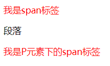
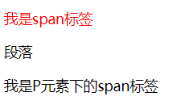

### css选择器有哪些以及它们的优先级？

选择器 | 名称 |描述
--|--|--
#id|id选择器|
.class|类选择器|
a|元素选择器| 指的是元素标签如h1,div
div,p|分组选择器|多个选择器同时满足对应规则
a[href]|属性选择器|指的是**标签元素**并且**属性**相同的节点
div p|后代选择器| 见下
div>p|子元素选择器| 见下
div+p|相邻选择器|相同父元素，并且是相邻元素
a:hover|伪类选择器|
*|通配符选择器|选择所有的元素标签

---
### 选择器优先级

内联样式 > ID 选择器 > 类选择器 = 属性选择器 = 伪类选择器 > 标签选择器 = 伪元素选择器

---

### 后代选择器与子元素选择器区别


```
<div>
    <span>我是span标签</span>
    <p>段落</p>
    <p>
        <span>我是P元素下的span标签</span>
    </p>
</div>
```
后代选择器
```
div span {
    color:red;
}
```
### 结果如图：


子元素选择器
```
div>span {
    color:red;
}
```
结果如图：



**结论：** 子元素选择器只选择元素标签的子元素不会选择孙子元素(嵌套中的span)，而后代选择器会选择元素标签内的所有span元素